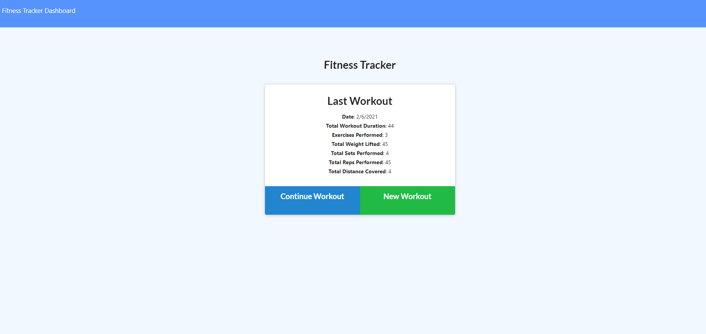

# fitness-tracker

This Fitness Tracker is an app which allows the user to add new workouts or update existing workouts with type, weight and reps.

The user should be able to:

  * Add exercises to the most recent workout plan.

  * Add new exercises to a new workout plan.

  * View the combined weight of multiple exercises from the past seven workouts on the `stats` page.

  * View the total duration of each workout from the past seven workouts on the `stats` page.

### Application link

* [GitHub repositories](https://github.com/mugich/fitness-tracker)
* [Heroku deployed link](https://safe-retreat-85381.herokuapp.com/?id=601f481088ceae0015372221)

### Application's appearance

